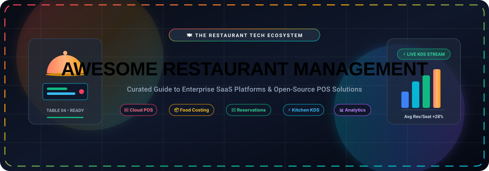

  

  
  
  
  
  
  

# 🍽️ Awesome-Restaurant-Management

## 🚀 Top Restaurant Management Platforms Ecosystem

**Curated Directory of Commercial SaaS Products & Open-Source GitHub Projects for Hospitality Tech**

*Comprehensive Guide Covering Restaurant POS, Kitchen Display Systems (KDS), Food Cost Inventory, Labor Scheduling, Table Reservations, Delivery Aggregation & Back-Office ERP Operations.*

📅 **Last updated: September 2026**

---

### 📖 Overview & Industry Scope
This repository tracks the leading **commercial SaaS platforms** and vetted **open-source projects** powering modern restaurants, ghost kitchens, bars, cafes, and multi-unit hospitality groups. These software systems orchestrate point-of-sale, kitchen order routing, automated food cost accounting, shift scheduling, floor plans, contactless QR ordering, and third-party delivery dispatch.

---

## 📑 Table of Contents
- [🏢 SaaS Products & Commercial Platforms](#-saas-products--commercial-platforms)
  - [📊 Market Size & Industry Concentration](#-market-size--industry-concentration)
  - [📋 SaaS Comparison Table](#-saas-comparison-table)
- [💻 Open-Source GitHub Projects](#-open-source-github-projects)
  - [⭐ Ranked Open-Source Solutions](#-ranked-open-source-solutions)
  - [🛠️ Architectural Guidance for Custom Stacks](#-architectural-guidance-for-custom-stacks)
- [🤝 How to Contribute](#-how-to-contribute)
- [📈 Star History](#-star-history)
- [⚠️ Disclaimer](#-disclaimer)

---

## 🏢 SaaS Products & Commercial Platforms

### 📊 Market Size & Industry Concentration
> 🌐 **Estimated Market Size & Industry Landscape**: The global restaurant management software and POS terminal market is valued at **~$7.5B – $8.0B in 2026** (projected to expand past **$18B – $30B by 2033** at a CAGR of ~14–16%). The sector is **moderately to highly fragmented** overall across horizontal workflows (hardware POS terminals, kitchen display systems, recipe costing, labor compliance, and delivery aggregation). However, select high-barrier niches demonstrate **strong concentration and winner-take-all network dynamics**—specifically enterprise hotel/stadium POS (*Oracle Simphony, Toast*) and consumer reservation networks (*OpenTable, Resy*), where two-sided diner liquidity and enterprise hardware integrations create formidable competitive moats.

### 📋 SaaS Comparison Table
*Sorted in descending order by Company Size (Enterprise Valuation / Market Capitalization / Annual Revenue).*

| 🏢 Platform / Product | 📝 Description | 💼 Company Size (Valuation / Revenue) | 💵 Pricing (Starting Tier) | 🎁 Free Tier / Trial Limit |
| :--- | :--- | :--- | :--- | :--- |
| **[Oracle Simphony](https://www.oracle.com/food-beverage/restaurant-pos-systems/simphony/)** | Enterprise-grade cloud POS and kitchen management system built for hotel chains, multi-unit restaurant groups, and stadiums. | **~$400B+ Market Cap** (Oracle parent, NYSE: ORCL; ~$53B annual revenue) | **$55/workstation/month** (Simphony Essentials tier; Simphony Plus at $75/workstation/mo) | **No free forever plan**; offers a **complimentary guided proof-of-concept sandbox demo** with an Oracle F&B solution architect. |
| **[Resy](https://resy.com/)** | Premium reservation, waitlist, and table management platform featuring guest CRM and direct diner booking network. | **~$190B+ Market Cap** (American Express parent, NYSE: AXP; acquired for $115M; ~$500M+ division val) | **$289/month** (Platform / Essential plan; Platform 360 at $399/mo) | **No free forever plan**; offers a **complimentary 1-on-1 live product demo & sandbox simulation** (100% free for end-user diners to book and join Notify waitlists). |
| **[OpenTable](https://www.opentable.com/)** | Global restaurant reservation and diner discovery network with table management, shift planning, and guest relationship tools. | **~$130B+ Market Cap** (Booking Holdings parent, NASDAQ: BKNG; acquired for $2.6B; ~$300M+ rev) | **$149/month** (Basic plan, plus $1.50/network cover & $0.25/direct cover; Core at $299/mo) | **30-day free trial** on the Basic plan (waives the $149/mo software subscription fee for 30 days; network per-cover fees of $1.50/diner still apply). |
| **[Clover](https://www.clover.com/)** | Modular POS hardware and software ecosystem handling order taking, table service, payments, and app marketplace extensions. | **~$80B+ Market Cap** (Fiserv parent, NYSE: FI; Clover division generates ~$2B+ revenue run-rate / $270B+ GPV) | **$14.95/month** (Payments Plus software) or **$44.95–$59.95/month** (Counter Service) / **$89.95/month** (Table Service) | **90-day free trial** on eligible software plans (e.g., Counter Service / Services Growth without hardware purchase, 1 per Tax ID; transaction fees apply). |
| **[TouchBistro](https://www.touchbistro.com/)** | iPad-based POS and restaurant management system tailored for table service, floor plan management, and menu costing. | **~$48B USD / $65B CAD Market Cap** (Acquired by Harris / Constellation Software, TSX: CSU for $100M in 2026; $300M+ raised) | **$69/month** (Solo plan for 1 terminal license, billed annually; Dual plan at $129/mo) | **28-day free trial** via the iPad App Store (7 days unregistered + 21 days upon account registration; full menu setup and local POS mode); guided live demo. |
| **[Square for Restaurants](https://squareup.com/us/en/point-of-sale/restaurants)** | Accessible cloud POS with table layout mapping, menu management, Square Online integration, and payment processing. | **~$40B+ Market Cap** (Block, Inc. parent, NYSE: SQ; Square division gross profit ~$3.5B+) | **$0/month** (Free Plan) or **$60/month** (Plus Plan per location) | **Free-forever plan** ($0/mo software fee, unlimited orders, 1 location, basic POS features; 2.6% + $0.10 in-person processing); **30-day free trial** for Plus plan (full KDS and advanced floor management). |
| **[Toast](https://pos.toasttab.com/)** | Restaurant-native POS with handheld terminals, kitchen display systems (KDS), online ordering, and offline card processing. | **~$19B Market Cap** (Publicly traded, NYSE: TOST; FY2025 Revenue ~$6.15B) | **$0/month** (Quick Start plan) or **$69/month** (Standard Point of Sale plan) | **Free-forever Starter Plan** ($0/mo software fee for 1–2 terminals, 1 location; ~3.09% + $0.15 per transaction); 30-day free trial on select add-on modules. |
| **[Revel Systems](https://revelsystems.com/)** | Cloud iPad POS architecture providing floor plan management, KDS, inventory tracking, and open API connectivity. | **~$6.5B Market Cap** (Shift4 parent, NYSE: FOUR; acquired Revel for $250M cash in 2024) | **$99/terminal/month** (billed annually, 2-terminal minimum, requires 3-year contract & Revel Advantage processing) | **No free forever plan**; offers a **customized live virtual sandbox demonstration** with a Revel solution consultant. |
| **[SpotOn](https://www.spoton.com/)** | Restaurant POS and payments platform with handheld ordering, kitchen display systems, and commission-free online ordering. | **$3.6B Valuation** (Privately held unicorn, Series F valuation $3.6B; $900M+ total funding; ~$250M+ ARR) | **$0/month** (Quick Start plan) or **$99/month** (Counter Service) / **$135/month** (Full Service) | **Free-forever "Quick Start" plan** ($0/month software subscription fee for 1 terminal with transaction-based processing rates); personalized live system demo. |
| **[Deliverect](https://www.deliverect.com/)** | Delivery order aggregation and POS integration hub that connects third-party delivery channels with restaurant kitchen workflows. | **$1.4B Valuation** (Privately held unicorn, Series D valuation $1.4B; $240M funding; ~$70M+ ARR) | **$89/month** (Starter tier for up to 350 online orders/month; or €69/mo in EU, scaling by volume) | **No free forever plan**; offers a **complimentary 1-on-1 live onboarding demo and channel integration review** with an integration engineer. |
| **[Lightspeed Restaurant](https://www.lightspeedhq.com/pos/restaurant/)** | Advanced restaurant POS with built-in inventory, recipe management, multi-location reporting, and open API integrations. | **$1.35B Market Cap** (Publicly traded, NYSE/TSX: LSPD; FY2025 Revenue ~$1.08B) | **$69/month** (Basic plan, billed annually with 1 terminal; $79/mo billed monthly) | **14-day free trial** for cloud POS back-office and select digital ordering add-ons (Order Anywhere); full access to sample store data and menu management. |
| **[Restaurant365](https://www.restaurant365.com/)** | Integrated back-office suite uniting restaurant accounting, food cost inventory, purchasing, scheduling, and payroll. | **$1.2B+ Valuation** (Privately held unicorn, $1B+ valuation via KKR / L Catterton / ICONIQ; $437M funding; $100M+ ARR) | **$249/location/month** (Accounting Core or Ops/Inventory Core tier; Essential suite at ~$499/location/mo) | **No free forever plan**; offers a **complimentary scheduled 1-on-1 live software demo & back-office workflow analysis** with an operations consultant. |
| **[CrunchTime](https://www.crunchtime.com/)** | Enterprise multi-unit operations platform for food cost tracking, actual vs. theoretical (AvT) analysis, and labor optimization. | **~$800M–$1.0B Valuation** (Privately held, backed by Great Hill Partners; acquired Zenput and DiscoverLink; ~$100M+ ARR) | **$40/location/month** (Ops Execution starting tier; enterprise inventory and labor suite typically ranges $100–$250/location/mo) | **No free forever plan**; offers a **complimentary 1-on-1 virtual product tour and enterprise food-cost audit** with a solutions specialist. |
| **[MarginEdge](https://www.marginedge.com/)** | Restaurant invoice automation, daily food cost tracking, recipe costing, and real-time inventory management platform. | **~$400M–$500M Valuation** (Privately held, raised $80M Series D in 2026, $162M total raised; ~$40M+ ARR) | **$330/location/month** (Base platform, billed monthly; $500/location/mo bundled with Freepour) | **No free forever plan**; offers a **complimentary live interactive demo and invoice scanning trial run** with an operations specialist. |
| **[7shifts](https://www.7shifts.com/)** | Restaurant-specific workforce management software for employee shift scheduling, labor compliance, and team communication. | **~$300M–$400M Valuation** (Privately held, $128M raised led by SoftBank Vision Fund 2; ~$35M–$50M ARR) | **$0/month** (Comp plan) or **$39.99/location/month** (Essentials plan billed annually, $44.99/mo billed monthly) | **Free-forever "Comp" plan** for 1 single location and up to 15 employees (basic scheduling and team chat, excludes time clock and POS sync); **14-day free trial** of the Pro plan (no credit card required). |
| **[MarketMan](https://www.marketman.com/)** | Cloud inventory and purchasing platform featuring automated AP invoice extraction, vendor ordering, and recipe costing. | **~$75M–$100M Valuation** (Acquired by Meal Ticket / PSG Equity; ~$20M ARR) | **$199/month** (Starter tier billed annually at $179/mo; Growth tier at $249/mo) | **No free forever plan**; offers a **complimentary 1-on-1 interactive live demo and inventory workflow consultation** with an F&B specialist. |
| **[Yellow Dog Inventory](https://www.yellowdogsoftware.com/)** | Robust F&B inventory and recipe management solution with barcode audits and deep integration across 400+ POS systems. | **~$50M–$80M Valuation** (Privately held, bootstrapped & profitable; ~$15M ARR) | **$129/location/month** (Standard entry tier via Square/Clover marketplace; multi-unit tiers up to $269/location/mo) | **No free forever plan**; provides a **complimentary live system walk-through and custom architecture consultation** with an implementation engineer. |
| **[BlueCart](https://www.bluecart.com/)** | Wholesale procurement and mobile ordering platform bridging commercial restaurant kitchens with food and beverage distributors. | **~$40M–$60M Valuation** (Privately held, $25M+ raised; ~$10M ARR) | **$0/month** (for restaurant buyers); **$10/month** (Vendor/Supplier Starter tier, scaling to $49+/mo) | **Free-forever plan for restaurant buyers** ($0/month subscription with unlimited order placement to wholesale suppliers, order check-in, and mobile ordering tools); **14-day free trial** for suppliers on vendor storefront tiers. |
| **[Eat App](https://restaurant.eatapp.co/)** | Cloud reservation and table management system offering commission-free direct booking, CRM profiles, and guest messaging. | **~$30M–$50M Valuation** (Privately held, $13M+ raised; ~$8M ARR) | **$0/month** (Free Plan) or **$49/month** (Starter tier; Pro tier at $129/mo) | **Free-forever plan** ($0/month, limited to 30 covers/month with basic online widget and table management); **14-day free trial** of the Pro plan with unlimited covers (no credit card required). |
| **[Tenzo](https://www.gotenzo.com/)** | AI-powered restaurant business intelligence and forecasting platform consolidating POS, labor, and inventory telemetry into actionable dashboards. | **~$20M–$35M Valuation** (Privately held, $5M+ raised; ~$5M ARR) | **$75/location/month** (Starter analytics tier; comprehensive forecasting suite typically $100–$150/location/mo) | **No free forever plan**; offers a **complimentary live interactive demo and tailored data-stack audit** with a hospitality data specialist. |

> 📌 *Note on Acquired Platforms*: **Upserve** was acquired by Lightspeed and integrated into **Lightspeed Restaurant**; **Compeat** was acquired by Restaurant365 and integrated into the **Restaurant365** platform.

---

## 💻 Open-Source GitHub Projects

### ⭐ Ranked Open-Source Solutions
*Repositories sorted in descending order by GitHub Star count. Stars_Badges dynamically reflect live repository metrics and link directly to stargazers.*

- **[Odoo Restaurant / POS](https://github.com/odoo/odoo)**   
  Comprehensive open-source ERP platform featuring a dedicated Restaurant Point-of-Sale, graphical table floor planning, bill splitting, kitchen printer routing, and inventory sync.

- **[ERPNext](https://github.com/frappe/erpnext)**   
  Leading enterprise FOSS resource planning system built on the Frappe framework with native Restaurant, Point of Sale, hospitality billing, recipe management, and supply chain modules.

- **[NexoPOS](https://github.com/Blair2004/NexoPOS)**   
  Modern Laravel, Vue.js, and Tailwind CSS point-of-sale system featuring multi-store management, stock procurement, automated order receipts, and modular extensions.

- **[Triangle POS](https://github.com/FahimAnzamDip/triangle-pos)**   
  Open-source inventory management and Point of Sale system developed with Laravel, Bootstrap, and Livewire for streamlined front-of-house billing and stock tracking.

- **[Flutter POS System](https://github.com/evan361425/flutter-pos-system)**   
  Cross-platform mobile and desktop POS application built with Flutter, designed for small cafes, diners, and independent food establishments.

- **[SambaPOS 3](https://github.com/emreeren/SambaPOS-3)**   
  Classic open-source touchscreen POS software engineered specifically for restaurant table service, ticket splitting, and kitchen printer routing.

- **[WallacePOS](https://github.com/micwallace/wallacepos)**   
  Web-based, extensible POS application utilizing standard modern web technologies for easy deployment in retail and food service environments.

- **[URY – Restaurant Management ERP](https://github.com/ury-erp/ury)**   
  Complete FOSS restaurant management suite built atop ERPNext, delivering end-to-end POS, kitchen display system (KDS), table reservations, order tracking, and financial analytics.

- **[Restaurant Management System (Android)](https://github.com/harismuneer/Restaurant-Management-System)**   
  Android-based RMS digitalizing daily restaurant operations including tableside mobile ordering, billing, kitchen queues, and hall inventory.

- **[Food Ordering System](https://github.com/haxxorsid/food-ordering-system)**   
  Full-stack food and item ordering architecture handling customer orders, kitchen status dispatch, and menu catalogs.

- **[Restaurant POS System (MERN)](https://github.com/amritmaurya1504/Restaurant_POS_System)**   
  Production-oriented restaurant POS stack built with MongoDB, Express, React, and Node.js for real-time table order dispatch, payment tracking, and inventory control.

- **[RestaurantProject POS](https://github.com/BryanTheLai/RestaurantProject)** [  
  Integrated restaurant management web application combining a customer-facing menu portal with an operational POS for table ordering and bill generation.

- **[QR Smart Restaurant (NestJS + React)](https://github.com/olasunkanmi-SE/restaurant)**   
  Smartphone-enabled dining app empowering patrons to view digital menus and submit orders directly to kitchen queues via QR code scanning.

- **[ERPNext Restaurant App](https://github.com/alphabit-technology/erpnext-restaurant)**   
  Specialized restaurant extension module for ERPNext, tailoring table billing, waiter assignments, and kitchen order tickets (KOT).

- **[CS10 Restaurant POS](https://github.com/BloomTech-Labs/CS10-restaurant-pos)**   
  Open-source Point of Sale system built on Node, Express, React, and MongoDB supporting floor map layouts and server shift tracking.

- **[Ordering Management System](https://github.com/phojie/ordering-management-system)**   
  Streamlined restaurant order routing and dispatch platform designed for small-to-medium food service operations.

- **[Laravel Restaurant POS](https://github.com/dipenparmar12/POS)**   
  Quick and easy browser-based POS tailored for dine-in restaurants, bakeries, and cafes across desktop, tablet, and mobile displays.

- **[Laravel POS](https://github.com/G4brym/Laravel-Restaurant-POS)**   
  Lightweight Laravel-powered restaurant Point of Sale system with table billing and menu management.

- **[Restaurant POS & KDS (React + SurrealDB)](https://github.com/ahmedali5530/restaurant-pos)**   
  Unified real-time restaurant POS built with React and SurrealDB for cafes, food trucks, and chains, integrating ordering, kitchen display, delivery, and inventory.

- **[Posnic](https://github.com/Posnic/POS)**   
  Offline-first open-source POS and billing software for restaurants and retail shops, with local checkout, kitchen order tickets, inventory, purchasing, receipts, and optional online/offline workflows.

---

### 🛠️ Architectural Guidance for Custom Stacks
For independent operators and software engineers evaluating an open-source or hybrid architecture:
- 🏗️ **Integrated ERP Approach**: Starting with **[Odoo](https://github.com/odoo/odoo)** or **[URY (ERPNext)](https://github.com/ury-erp/ury)** provides unified accounting, purchasing, and POS within a single relational database.
- ⚡ **Lightweight Front-of-House**: Combining a standalone POS like **[NexoPOS](https://github.com/Blair2004/NexoPOS)** or **[Flutter POS](https://github.com/evan361425/flutter-pos-system)** with thermal receipt printers enables low-overhead, offline-resilient cashier terminals.
- 🛡️ **PCI Compliance & Payments**: Pure open-source platforms require PCI DSS audit compliance when capturing cards. Most production deployments connect open POS terminals to external certified payment gateways (e.g., Stripe Terminal, Square Reader API, or Adyen).
- 🔄 **Hybrid Architecture**: Many operators utilize open-source software for back-office inventory control and recipe costing, while maintaining a commercial POS (*Toast, Square, Clover*) for front-of-house payment reliability and 24/7 emergency support.

---

## 🤝 How to Contribute
1. 🍴 Fork the repository.
2. 🌿 Create your feature branch (`git checkout -b feature/add-new-platform`).
3. 📝 Add or update entries in `README.md`:
   - Keep descriptions factual, concise, and linked to official sites.
   - For SaaS products, include company size (valuation/revenue), specific starting pricing, and exact free tier/trial limits in the comparison table.
   - For open-source repos, include the social Stars_Badge linking to its `/stargazers` page.
4. 🚀 Submit a Pull Request with a clear description of the addition.

⭐ **Star the repo** on [GitHub](https://github.com/ishandutta2007/Awesome-Restaurant-Management) if you find it helpful!

---

## 📈 Star History

---

## ⚠️ Disclaimer
- 📋 This is a **community-curated list** provided strictly for educational and informational purposes — it does not constitute commercial endorsement or financial advice.
- 🔒 Hospitality operations involve regulated financial payments, food safety logging, and patron data privacy. Ensure that any self-hosted or commercial deployment adheres to PCI DSS standards, local labor laws, and food safety sanitation regulations.

---

  Curated with ❤️ by <a href="https://github.com/ishandutta2007">Ishan Dutta</a> and community contributors.

